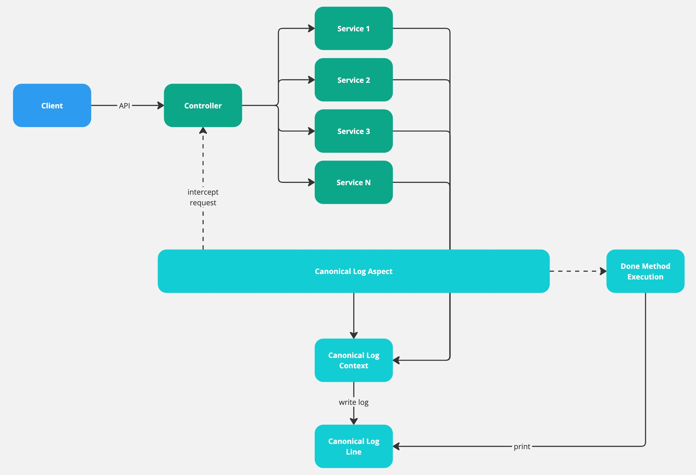

# 🚀 Canonical Logging Narrative

## ✨ Background
Canonical Logging is a way to design the logging approach in your system. In traditional logging approach, you will need
to call `log.info(...)` multiple times in order to print logs in different locations. This increases number of logs and
makes logs difficult to read and understand.
With canonical logging, every API request will have a single log with key-value pair to indicate the key information of
the request lifecycle, meaning that, you can put different data into a log context, the data can be the key information
that you need for the request like user id, error message, invoke dependency services success or not, and etc.

## 🥳 Installation

```xml
<dependency>
   <groupId>io.github.raychongtk</groupId>
   <artifactId>canonical-logging</artifactId>
   <version>0.0.1</version>
</dependency>
```

## 🔥 Problem

1. **Scattered log entries**: We need to invoke `log.info(...)` each time I need a log for a variable in different
   places. Eventually generating too many log entries in a request. It is difficult to understand logs in a ton of log
   entries. We need one place for key telemetry so that engineers can understand logs faster.
2. **Unstructured log format**: It causes log searching and aggregating hard. We need a structural log format to make
   engineers life easier and create better observability for the app.

## 💖 Benefit

1. **Reduce number of logs**: you don't need to print multiple logs in multiple locations in many use cases
2. **Better observability**: now, you only need to look at the canonical log whenever you need to investigate something
   because the log already provide key information for you
3. **Easy to understand**: a canonical log contains all key telemetry including error, request information, invocation
   metadata. etc.

## 👑 Architecture



Now, you have canonical log. Does it mean you don't need traditional logging? No. You still need it. Canonical log is
used to provide key information in high-level, however, if you want to dive into something, you might still need
traditional logging to provide more details. Therefore, we use a mixed approach for logging. Canonical log provide key
information and traditional logs provide more information to complement the canonical log.

How to link the canonical log with traditional logs? Use distributed tracing!


## 🧁 Demonstration

```java
@RestController
public class DemoController {
   @Autowired
   DemoService demoService;

   @CanonicalLog
   @GetMapping("/api/v1/demo")
   public String demo() {
      CanonicalLogContext.put("test", "test string");
      CanonicalLogContext.put("test_string", "test string");

      demoService.demo();
      return "canonical logging";
   }
}
```

```java
@Service
public class DemoService {
   private static final Logger logger = CanonicalLoggerFactory.getLogger("canonical-log");

   public void demo() {
      CanonicalLogContext.put("demo_key", "demo_value");
      CanonicalLogContext.put("demo_key2", "demo_value2");

      logger.info("intermediate log");
      CanonicalLogContext.trackReadOperation("http");
      CanonicalLogContext.trackReadOperation("http");
      CanonicalLogContext.trackWriteOperation("http");
      CanonicalLogContext.trackWriteOperation("http");

      for (int i = 0; i < 10; i++) {
         CanonicalLogContext.stat("read_count", 1);
      }
   }
}
```

---
### 1️⃣ How to apply canonical log?
1. Annotated the method that you want to have Canonical Logging with `@CanonicalLog`
2. Put key information into log context by invoking `CanonicalLogContext.put(key, value)`
3. Put stat information into log context by invoking `CanonicalLogContext.stat(key, value)`
4. Put performance metric into log context by invoking `CanonicalLogContext.trackReadOperation(...)`
   or `CanonicalLogContext.trackWriteOperation(...)`

As a result, you will see something like this:

```json
{
   "test": "test string",
   "end_time": "2024-09-08T01:22:46.432957",
   "start_time": "2024-09-08T01:22:46.413748",
   "method_name": "demo",
   "demo_key": "demo_value",
   "test_string": "test string",
   "elapsed_time": 18,
   "http": {
      "total_read_write": 4,
      "read_count": 2,
      "write_count": 2
   },
   "log_message": "canonical log done",
   "id": "95be53fa-a4c1-4ead-835f-2f08d0a42c33",
   "class_name": "com.canonical.log.controller.DemoController",
   "demo_key2": "demo_value2",
   "read_count": 10.0
}
```

---
### 2️⃣ How to enable performance warning?

Canonical Log supports tracking I/O performance metric with warning when high I/O operation happens in a single call.
To enable performance warning feature, the following configuration must be defined in the `application.properties` file

```properties
logging.canonical.performance.warning.enabled=true
logging.canonical.performance.warning.maxReadCount=10
logging.canonical.performance.warning.maxWriteCount=10
logging.canonical.performance.warning.maxTotalReadWrite=20
```

By default, the library maintain 5, 5, 10 for read/write/total accordingly

```properties
logging.canonical.performance.warning.enabled=true
```

If default value is accepted, you can simply enable the warning without configuring threshold for I/O warning

```text
high total I/O, operation=http, current count=2, max count=1
high read I/O, operation=http, current count=2, max count=1
high total I/O, operation=http, current count=3, max count=1
high total I/O, operation=http, current count=4, max count=1
high write I/O, operation=http, current count=2, max count=1
```

If the threshold is met, the warning will be printed out as extra logs

---
### 3️⃣ How to mask sensitive fields?

Canonical Log supports masking sensitive fields that belongs to `String` type with a simple configuration

```properties
logging.canonical.masking.keys=token,name
```

Once this is configured in the application, any key with `token` and `name`, its value will be masked. Only the head and
tail characters will be kept. This feature supports only basic data types including integer, long, short, double, float,
and string.

---
### 4️⃣ Canonical Logger
This library also provide a Canonical Logger for you to print logs with the key value pairs that exists in the canonical
log context.

Canonical Logger built on top of Logback as the logging library but reformat the log message in Canonical Log format
with key information attached.

```java
private static final Logger logger = CanonicalLoggerFactory.getLogger("canonical-log");
```

Declare a logger in this way will print log message with existing values inside the canonical log context

This is useful when you need the intermediate values attached in a log

The `logger.info("intermediate log")` will print an intermediate log with canonical log context, the result will be:

```json
{
   "start_time": "2024-09-08T00:49:03.531121",
   "test": "test string",
   "method_name": "demo",
   "demo_key": "demo_value",
   "test_string": "test string",
   "end_time": "2024-09-08T00:49:03.531603",
   "http": {
      "total_read_write": 1,
      "read_count": 1,
      "write_count": 0
   },
   "log_message": "intermediate log",
   "id": "33cd6566-791c-411e-9c1e-ffb399c38397",
   "class_name": "com.canonical.log.controller.DemoController",
   "demo_key2": "demo_value2"
}
```

You will see the `log_message` is `intermediate log`

That said, the key-value pairs written into the canonical log context will all attach to the log when
the `logger.info(...)`
is called

If you declare a logger with normal logger factory, you will only get the log message without any canonical log
information attached

---
### 5️⃣ Normal Logger
```java
private static final Logger logger = LoggerFactory.getLogger("canonical-log");
```

By using this logger, when you call `logger.info(...)`, it will print

```
intermediate log
```

That said, it will not attach any canonical log information.

---
Either way is fine. Choose the best one for your use case.

If you are interested in canonical log, you can check out the following articles:

1. https://stripe.com/blog/canonical-log-lines
2. https://brandur.org/nanoglyphs/025-logs
3. https://baselime.io/blog/canonical-log-lines
4. https://brandur.org/canonical-log-lines